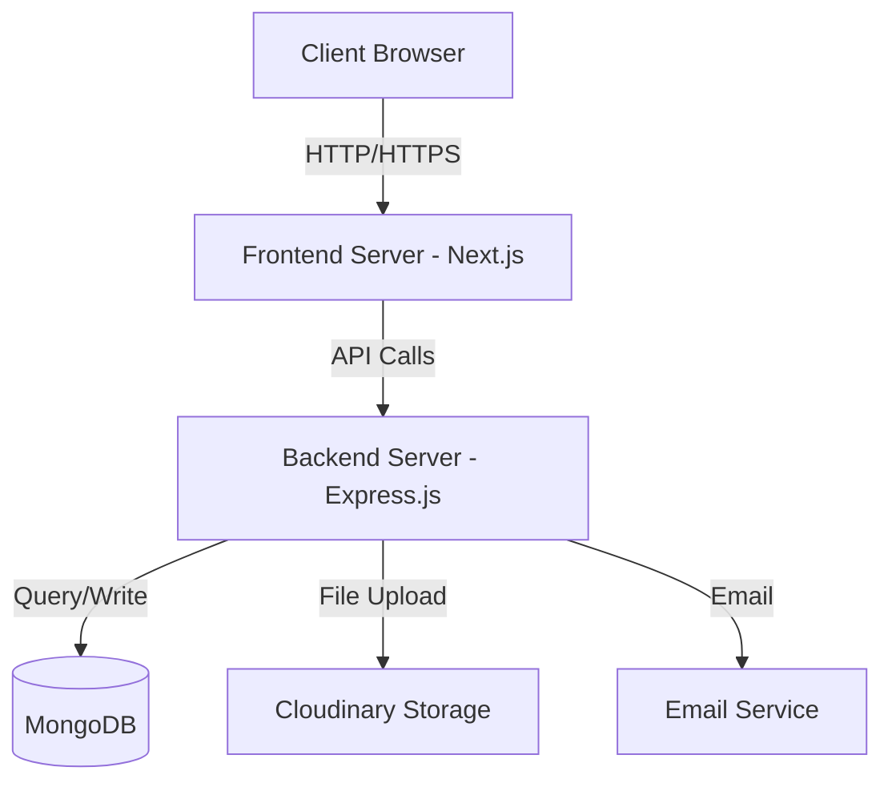
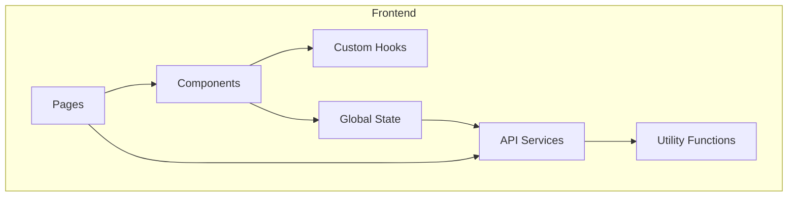
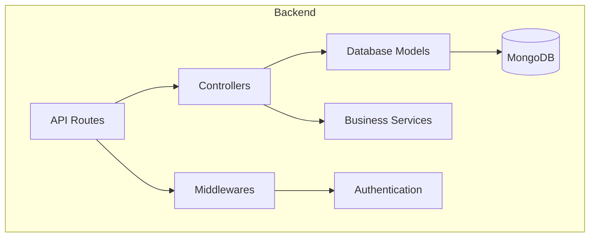
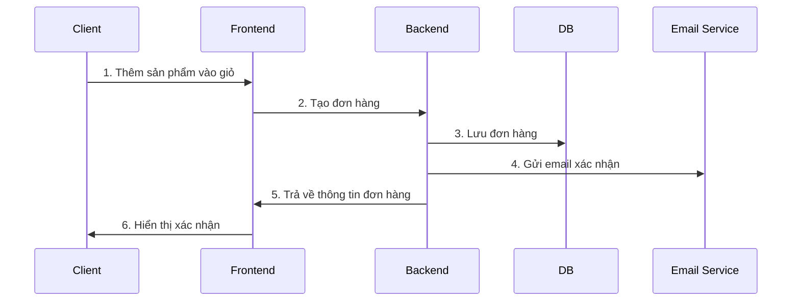
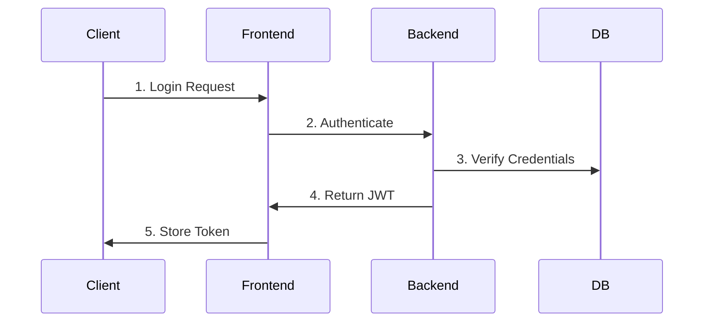

# H24Store System Architecture

## Tổng quan hệ thống



## Chi tiết kiến trúc Frontend



## Chi tiết kiến trúc Backend



## Luồng xử lý đơn hàng



## Authentication Flow



## Deployment Architecture

```mermaid
graph TD
    subgraph Production
        C[Client] -->|HTTPS| CDN[CDN]
        CDN --> VM1[Frontend Server]
        VM1 --> VM2[Backend API Server]
        VM2 --> DB[(MongoDB Atlas)]
        VM2 --> CS[Cloudinary CDN]
    end
